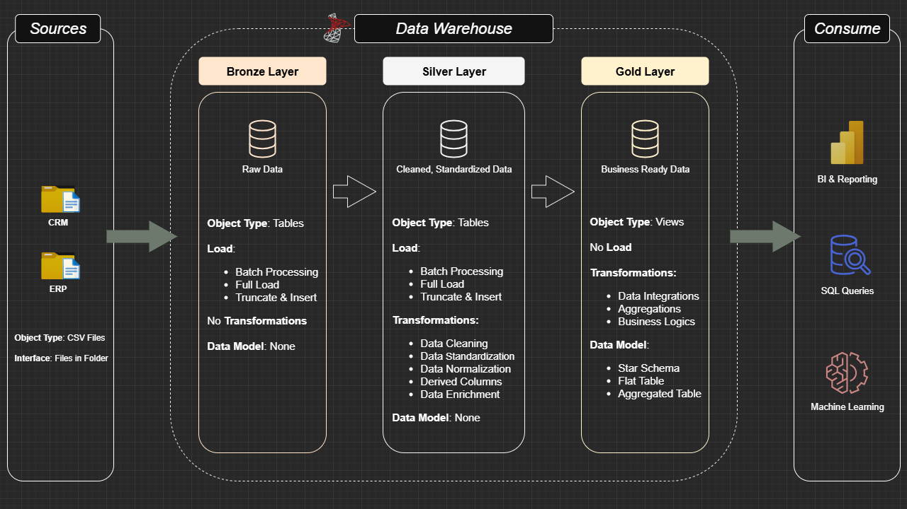

# Data Warehouse and Analytics Project
This project demonstrates a comprehensive end-to-end SQL Server Data Warehouse and analytics solution covering all stages from building the warehouse to generating actionable business insights. The architecture follows the Medallion Architecture with Bronze, Silver, and Gold layers to ensure high data quality, scalability and readiness for analytical reporting.

The project encompasses the following key components:

- **Data Architecture** -- Designing a modern data warehouse with Bronze, Silver, and Gold layers to structure raw, cleansed, and business-ready data.

- **ETL Pipelines** -- Extracting data from multiple source systems, transforming it to ensure consistency and quality, and loading it into the warehouse.

- **Data Modeling** -- Creating fact and dimension tables optimized for analytical queries, enabling efficient reporting and insights.

- **Analytics & Reporting** -- Developing SQL-based reports to provide actionable insights for stakeholders and support data-driven decision-making.

Next Steps / Related Projects:

1️⃣ Explore data and uncover initial insights: [sql-eda-project](https://github.com/devoodian/sql-eda-project)

2️⃣ Analyze trends, performance, and generate reports: [sql-data-analytics-project](https://github.com/devoodian/sql-data-analytics-project)

## Data Architecture


## Project Requirements

### 1. Building the Data Warehouse

#### Objective
Develop a modern data warehouse using SQL Server to consolidate sales data, enabling analytical reporting and informed decision-making.

#### Specifications
- **Data Sources**: Import data from two source systems (ERP and CRM) provided as CSV files.
- **Data Quality**: Cleanse and resolve data quality issues prior to analysis.
- **Integration**: Combine both sources into a single, user-friendly data model designed for analytical queries.
- **Scope**: Focus on the latest dataset only; historization of data is not required.
- **Documentation**: Provide clear documentation of the data model to support both business stakeholders and analytics teams.

### 2. BI: Analytics & Reporting

#### Objective
Develop SQL-based analytics to deliver detailed insights into:
- **Customer Behavior**
- **Product Performance**
- **Sales Trends**

These insights empower stakeholders with key business metrics, enabling strategic decision-making.  

## Repository Structure
```
sql-dwh-project/
│
├── datasets/                           # Raw data from CRM and ERP sources
│
├── docs/                               # Project documentation and diagrams
│   ├── data_architecture.png           # Medallion Architecture overview
│   ├── data_catalog.md                 # Gold layer tables and metadata
│   ├── data_flow.png                   # Data flow diagram from source to Gold
│   ├── data_integration.png            # Integration steps and mapping
│   ├── data_models.png                 # Star schema models
│
├── scripts/                            # SQL scripts for ETL and transformations
│   ├── bronze/                         # Scripts to extract and load raw data
│   ├── silver/                         # Scripts for cleaning and standardizing data
│   ├── gold/                           # Scripts to create fact and dimension tables
│
├── tests/                              # Test scripts and quality checks
│
├── README.md                           # Project overview and instructions
├── LICENSE                             # Repository license
```
